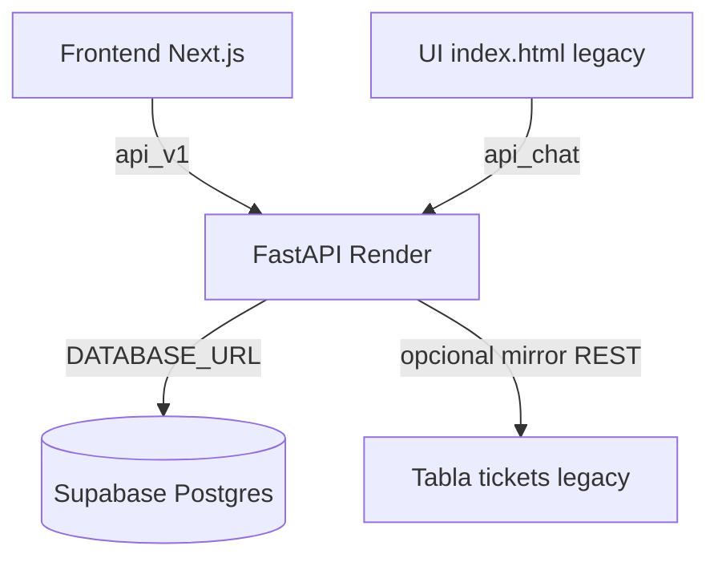

# Arquitectura de la Plataforma Agéntica

## Resumen

**Canónico (producción):** frontend Next.js → `/api/v1/*` → Data Estate en Postgres (`tickets_estate`).

**Legacy (deprecado):** `index.html` / Netlify estático → `/api/chat`, `/api/estructurar`, `tickets_store`.



## Fuente de verdad

| Dato | Fuente canónica | Legacy (no usar en piloto) |
|------|-----------------|----------------------------|
| Tickets operativos | `tickets_estate` (Postgres) | `tickets` vía REST / JSON |
| Casos de chat | `casos_conversacion` | historial no persistido en legacy |
| Usuarios / orgs | `users`, `organizations` | `MOCK_USERS` solo seed |
| Líneas JSC | `lineas_jsc` (réplica demo) | — |
| KB tenant | `kb_articulos` | RAG Markdown global en `/api/chat` |

Con `DATABASE_URL` Postgres activo, el mirror REST a Supabase (`SUPABASE_URL`) **no se usa** — ver `es_mirror_supabase_activo()` en `app/config.py`.

## Flujo v3 (canónico)

```
POST /api/v1/chat
  → motor conversacional + intérprete
  → prefilter / triaje / diagnóstico
  → clasificador N1/N2
  → ticket_bridge → tickets_estate
  → respuesta al operador
```

Archivos clave:

| Componente | Archivo |
|------------|---------|
| Pipeline | `app/agents/pipeline.py` |
| Motor conversacional | `app/services/motor_conversacional.py` |
| Intérprete variantes | `app/services/interprete_conversacional.py` |
| Clasificador | `app/services/clasificador.py` |
| Tickets | `app/services/ticket_bridge.py` |
| Persistencia | `app/estate/repository.py` |
| JSC | `app/jsc/connector.py`, `app/jsc/contract.py` |

## Flujo legacy (deprecado)

```
POST /api/chat          → chat_service + RAG Markdown global
POST /api/estructurar   → extraction_service
POST /api/crear-ticket  → tickets_store / Supabase REST
```

Respuestas incluyen headers:

- `X-API-Deprecated: true`
- `X-API-Canonical: /api/v1`

El frontend Next.js consume **solo v3** (`frontend/src/lib/api-client.ts`).

## Lógica legacy que se conserva (como referencia)

| Lógica | Origen legacy | Destino v3 |
|--------|---------------|------------|
| Detección escalamiento | `extraction_service` | `app/domain/escalamiento.py` |
| KB aplicable antes de ticket | `extraction_service` | `app/services/clasificador.py` |
| RAG Markdown | `knowledge_rag.py` | `knowledge_unified.py` |

## Lógica legacy que NO se migra

- `tickets_store` JSON local — reemplazado por Data Estate Postgres
- `/api/chat` sin multitenancy — deprecar cuando v3 cubra todos los casos
- Tabla `tickets` REST duplicada — opcional, desactivada con Postgres

## Principio rector

**Inteligente antes de IA**: reglas → KB → JSC/telemetría → clasificador → LLM solo para redactar.

## Modelo operativo N1 / N2

| Nivel | Rol | Acción del bot |
|-------|-----|----------------|
| **N1** | Cooperativas revendedoras | Guiar con KB; ticket N1 si no alcanza |
| **N2** | NOC imowi | Ticket interno tras persistencia post-N1 o escalamiento directo |

Demo: sin ticketera externa. Proveedor sugerido queda en ticket N2 local.

## Despliegue productivo

Ver [PRODUCCION-SUPABASE.md](./PRODUCCION-SUPABASE.md) y [FRONTEND-DEPLOY.md](./FRONTEND-DEPLOY.md).

Health: `GET /health` → `database: postgresql`, `database_connected: true`.

## Próximos pasos

1. Piloto con matriz [PILOTO-VALIDACION.md](./PILOTO-VALIDACION.md)
2. Integración JSC real — [JSC_INTEGRACION.md](./JSC_INTEGRACION.md)
3. Deprecar endpoints legacy cuando el piloto esté validado
