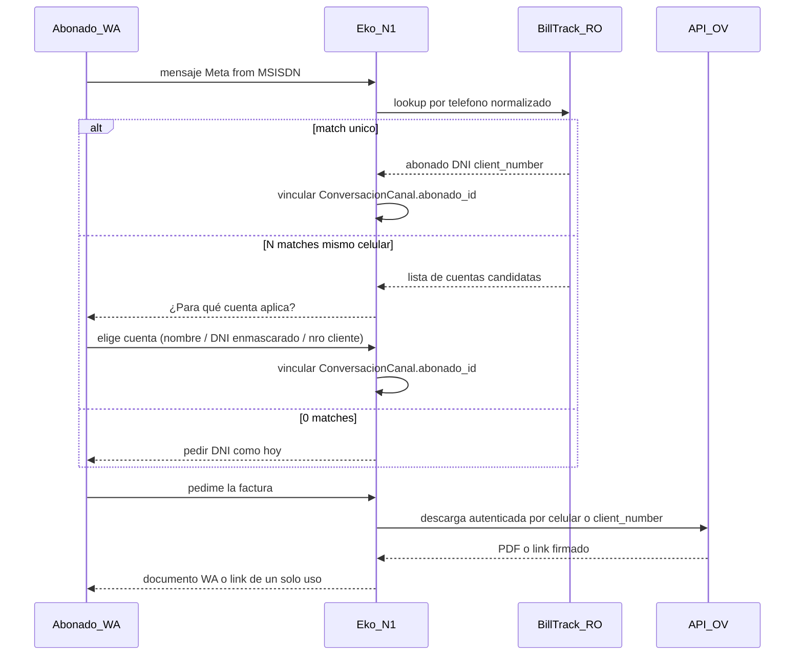

# Brief: integración OV + auth WhatsApp (facturas)

Documento de diseño. **No implica implementación** en esta etapa.
Alcance: autenticación de abonado por MSISDN de origen en WhatsApp contra padrón BillTrack / Oficina Virtual (OV), y contrato para entregar facturas por chat cuando existan los endpoints OV.

Relacionado: [`PORTAL-ABONADO.md`](PORTAL-ABONADO.md), [`CONFIG-PLATAFORMA.md`](CONFIG-PLATAFORMA.md), blueprints facturación en [`rag-botmaker-2026-08-14/collections/02_facturacion_pagos/`](rag-botmaker-2026-08-14/collections/02_facturacion_pagos/).

---

## 1. Contexto y gap actual

### Qué hace Eko hoy

| Canal | Identidad del hilo | Identidad de cuenta | Facturas |
|---|---|---|---|
| Portal web / app | sesión JWT | DNI + OTP email (o PIN) | Guía a mail registrado + OV |
| WhatsApp | MSISDN Meta (`msg.from`) | DNI declarado en el chat → BillTrack RO | Igual: sin PDF adjunto |
| Telegram | `chat_id` (no es celular) | DNI declarado en el chat | Igual |

Piezas relevantes:

- Lookup BillTrack **solo por DNI**: `lookup_abonado_por_dni` en [`app/services/billtrack.py`](../app/services/billtrack.py). El SQL (`DEFAULT_LOOKUP_SQL`) ya lee `api_person_phone`, pero el `WHERE` es por documento.
- Soft-match local por teléfono en réplica estate: `find_abonado_por_telefono` en [`app/estate/canal_repo.py`](../app/estate/canal_repo.py) — no consulta BillTrack y no se trata como login verificado.
- Pedido de factura en N1: `_mensaje_envio_factura_ov` en [`app/services/diagnostico_n1.py`](../app/services/diagnostico_n1.py) — mail + `https://ov.batan.coop`; texto explícito: *«Por este chat no te adjunto el PDF»*.
- Blueprint histórico `facturacion_factura` / `facturacion_descarga`: `rag_ready: false`; pide «consulta autenticada de facturas» y «entrega segura de documentos».

### Qué no existe hoy

- `lookup_abonado_por_telefono` contra BillTrack.
- Cliente HTTP de la API OV (`ov.batan.coop/api`).
- Envío de documento PDF por WhatsApp (hay `subir_media` / audio en [`app/services/whatsapp_client.py`](../app/services/whatsapp_client.py); no hay `send_document`).
- Auth cruzada OV ↔ Eko.

---

## 2. Precedente Botmaker (`jsat-get-link-ov`)

Script de acción de usuario en Botmaker (Node 22). Patrón de confianza de canal:

1. Si el chat **no** es WhatsApp → link genérico `https://ov.batan.coop/#/{path}` (sin deep-link autenticado).
2. Si es WhatsApp → toma el celular de origen (`PLATFORM_CONTACT_ID`).
3. Mantiene sesión de **servicio** contra `https://ov.batan.coop/api` (`/session/check`, `/session/login` con usuario técnico).
4. Pide deep-link: `GET /ov/link?celular={msisdn}&path={path}` con header `sid`.
5. Si OK → envía el link firmado/rápido; si falla → fallback al hash público.

Paths de menú usados hoy (parámetro `params.path`):

| `path` | Uso |
|---|---|
| `my?useCustomer=true` | Ver servicios (requiere usuario OV) |
| `talon-de-pago?useCustomer=true` | QR / talón de pago |
| `pagar?useCustomer=true` | Abonar factura |
| `comprar-pack?userCustomer=true` | Pack datos imowi (nota: typo histórico `userCustomer`) |
| `portabilidad?useCustomer=true` | Estado portabilidad imowi |

**Regla de este brief:** no versionar ni pegar credenciales del usuario técnico OV. Auth de servicio vive en secretos de plataforma / settings; rotar cualquier clave que haya circulado en chats o scripts compartidos.

---

## 3. Modelo de identidad propuesto (fase WhatsApp)

### Decisión cerrada

- **WhatsApp:** el MSISDN de origen Meta se trata como *trust de canal* (equivalente al patrón JSAT) cuando el celular aparece en padrón (`api_person_phone` / teléfono BillTrack) tras normalización E.164. Si hay **varias cuentas** con el mismo número, Eko **desambigua** preguntando para cuál aplica (no salta directo a pedir DNI).
- **Telegram:** **fuera** del auth por número de origen en v1. El webhook guarda `chat_id` vía `normalizar_identidad`; no hay celular. Se sigue pidiendo DNI. Caminos futuros (F3): compartir contacto, o OTP email como portal.
- **Portal / app:** sin cambio; siguen DNI + OTP/PIN. El trust WA **no** sustituye el OTP email del portal.

### Flujo

### Reglas de match

1. Normalizar con la misma lógica que `normalizar_telefono` (prefijo `54`, strip no-dígitos, sufijo 10).
2. Consultar BillTrack RO por teléfono (nuevo SQL / función; solo `SELECT`). Traer **todos** los hits del MSISDN (no `LIMIT 1` en el reverse-lookup).
3. **Un** hit → `ensure_local_abonado` + vincular `ConversacionCanal.abonado_id` (mismo camino que tras DNI).
4. **Varios** hits (mismo celular en más de una cuenta) → **desambiguar en el chat**: preguntar para qué cuenta aplica. Mostrar opciones mínimas y no sensibles de más, p.ej. nombre (o iniciales), DNI enmascarado (`*******122`) y/o `client_number`. Al elegir → vincular esa cuenta. Si no reconoce ninguna → pedir DNI (fallback).
5. **Cero** hits → no auto-identificar; pedir DNI como hoy.
6. Teléfono vacío en padrón para ese MSISDN → pedir DNI.
7. Tras vínculo, el refresh de saldo/estado sigue siendo por DNI (fuente de verdad actual).

**UX de desambiguación (N matches):** una sola pregunta, lista numerada corta (tope razonable, p.ej. 5). No exponer deuda ni email en la lista de opciones. Hasta que elija, el hilo sigue **no identificado** para facturación/saldo.

---

## 4. Contrato OV — plantilla a completar

Completar cuando existan specs reales. **No pegar secretos** en este doc ni en el chat; indicar solo nombres de variables de entorno / settings.

### 4.1 Datos comunes

| Campo | Valor / nota |
|---|---|
| Base URL | p.ej. `https://ov.batan.coop/api` — _completar_ |
| Ambiente | prod / staging — _completar_ |
| Auth de servicio | login+sid / API key / OAuth — _completar_ |
| Dónde vive el secreto | settings plataforma / env — _nombre de key, no el valor_ |
| Identificador del abonado hacia OV | `celular` (MSISDN) / `client_number` / ambos — _completar_ |
| Normalización esperada del celular | ¿`549…` sin `+`? ¿con `15`? — _completar_ |
| Timeout recomendado | p.ej. 20s (JSAT usa 20s) |
| Rate limit | _completar_ |
| Idempotencia | _completar_ |

### 4.2 Checklist por endpoint

Para **cada** endpoint de facturación/descarga, completar una fila o una subsección:

#### Endpoint A — _nombre / path_

| Ítem | Detalle |
|---|---|
| Método + path | GET/POST `…` |
| Auth | header `sid` / Bearer / … |
| Query/body | params |
| Identidad abonado | `celular=` / `client_number=` |
| Respuesta OK | shape JSON; ¿PDF binario, `application/pdf`, o URL firmada? |
| TTL del link (si aplica) | |
| Errores | no match, varios match, sin factura, sesión inválida, 4xx/5xx |
| Uso en Eko | listar períodos / última factura / talón |

#### Endpoint B — _nombre / path_

_(misma tabla)_

#### Endpoint C — deep-link (precedente conocido)

| Ítem | Detalle |
|---|---|
| Método + path | `GET /ov/link` (precedente Botmaker) |
| Auth | header `sid` de sesión servicio |
| Query | `celular`, `path` |
| Respuesta OK | `status=OK` + `result` = URL |
| Fallback Eko | hash público OV si falla |
| Paths soportados | ver §2 |

### 4.3 Preferencia de entrega en WhatsApp (decisión de producto F2)

Orden preferido cuando exista la API:

1. **URL firmada de un solo uso** (TTL corto) — menos peso en Cloud API, auditable.
2. **PDF bytes** → `subir_media` + mensaje tipo `document` en WhatsApp.
3. Si OV no puede entregar archivo ni URL firmada → deep-link `/ov/link` (patrón JSAT) o guía mail+OV actual.

### 4.4 Open items (dueño: producto / OV)

- [ ] Pegar specs o OpenAPI de listado + descarga de facturas (sin secretos).
- [ ] Confirmar si la API autentica al abonado solo por celular de padrón o también exige `client_number`.
- [ ] Confirmar si un celular puede mapear a más de una persona en BillTrack/OV.
- [ ] Rotar credencial de servicio OV que haya circulado fuera de vault.
- [ ] Definir períodos entregables (última factura vs histórico) y tope N1.

---

## 5. Política de seguridad

| Tema | Regla |
|---|---|
| Nivel de trust WA | Equivalente JSAT: prueba de posesión del canal Meta, no OTP email. |
| Alcance de operaciones | Solo **lectura**: saldo ya expuesto a identificados, PDF/factura, deep-links de pago/consulta. **No** cambio de datos fiscales, email, titularidad ni baja por este trust. |
| Ambigüedad | 0 matches → DNI. N matches → desambiguar cuenta (nombre / DNI enmascarado / nro cliente); sin deuda/email en la lista. Hasta elegir, no exponer saldo/factura. |
| SIM swap / celular compartido | Riesgo aceptado al nivel del deep-link OV actual; mitigado por alcance de lectura y auditoría de envíos. |
| Telegram | Sin trust por origen en v1. |
| Portal | Sin degradar OTP email. |
| Secretos | Usuario técnico OV solo en config segura; nunca en git, docs ni prompts. |
| Logging | No loguear SID completo, PDF, ni PII de más; correlacionar por `abonado_id` / hash de MSISDN si hace falta. |

---

## 6. Mapa a Eko (implementación futura — no esta sesión)

| Fase código | Enganche | Notas |
|---|---|---|
| F1 Auth WA | Nuevo `lookup_abonado_por_telefono` en `billtrack.py` (SQL RO sobre `api_person_phone`) | Reusar `map_lookup_row` / `ensure_local_abonado` |
| F1 Auth WA | `procesar_mensaje_entrante` en [`canal_abonado.py`](../app/services/canal_abonado.py) | Antes o junto al soft-match local; solo `canal=whatsapp` |
| F1 Auth WA | Tests: normalización, match único, 0 hits → DNI, N hits → desambiguación, no aplicar en telegram | Sensores: `pytest` + `ruff` |
| F2 Facturas | Cliente HTTP OV (módulo nuevo bajo `app/services/`) | Auth servicio según §4; sin hardcode |
| F2 Facturas | Sustituir gradualmente `_mensaje_envio_factura_ov` | Si hay PDF/URL firmada y abonado identificado por WA/DNI |
| F2 Facturas | Extender `whatsapp_client` con envío `document` | Reusar `subir_media` |
| F2 Facturas | Intenciones `facturacion_factura` / `facturacion_descarga` | Alinear con blueprints cuando `rag_ready` |
| F3 Telegram | Contacto compartido o OTP email | Fuera de v1 |

**No** asumir Redis/SID idéntico al script Botmaker hasta ver el auth real de la API en F2.

---

## 7. Fases

| Fase | Qué | Criterio de cierre |
|---|---|---|
| **F0** (esta sesión) | Este brief | Doc revisable; contrato OV en plantilla; WA vs TG cerrados |
| **F1** | Auth WA por teléfono (sin PDF) | Match único vincula; N matches desambigua cuenta; 0 matches → DNI; tests verdes — **hecho** (`lookup_abonados_por_telefono`, canal WA) |
| **F2** | Endpoints OV + entrega factura | Specs completadas en §4; envío PDF o link firmado en WA |
| **F3** | Telegram (si se prioriza) | Contacto u OTP; sin fingir MSISDN de origen |

---

## 8. Criterio de cierre F0

- [x] Gap documentado respecto a Eko actual.
- [x] Precedente JSAT descrito sin secretos.
- [x] Modelo WA (match único / N → desambiguar cuenta / 0 → DNI) y exclusión Telegram v1.
- [x] Plantilla/checklist de endpoints OV lista para completar.
- [x] Seguridad y fases F1–F3.
- [ ] Specs OV reales pegadas en §4 (pendiente de dueño OV/producto).
