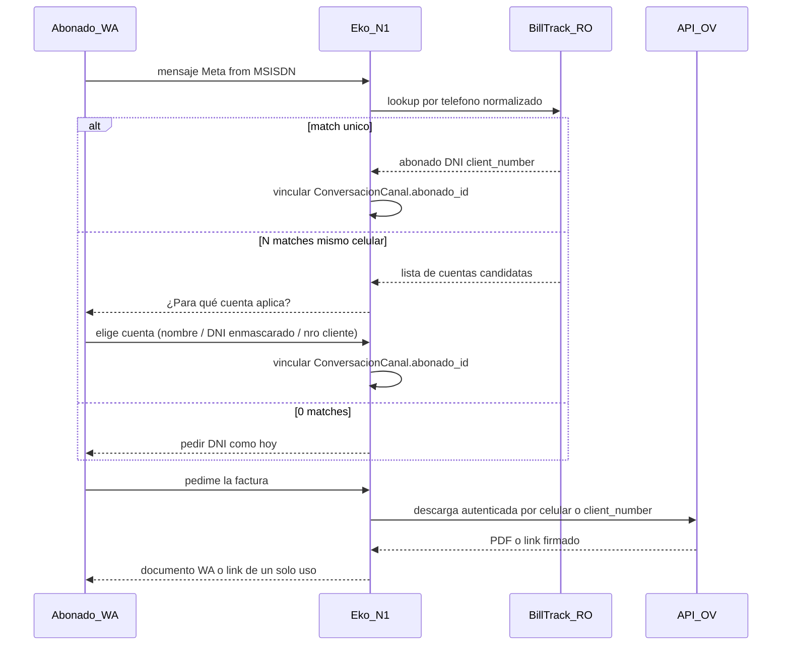

# Brief: integración OV + auth WhatsApp (facturas)

**Cómo se ofrece al abonado (sin menú estático):** Eko clasifica el gesto en lenguaje natural (`app/services/ov_intencion.py`): ver/descargar factura, pagar, talón/QR, pack, portabilidad. Si pide “oficina virtual” o “factura” sin detalle, hace **una** pregunta de aclaración (no lista 1) 2) 3)).

Relacionado: [`PORTAL-ABONADO.md`](PORTAL-ABONADO.md), [`CONFIG-PLATAFORMA.md`](CONFIG-PLATAFORMA.md), blueprints facturación en [`rag-botmaker-2026-08-14/collections/02_facturacion_pagos/`](rag-botmaker-2026-08-14/collections/02_facturacion_pagos/).

---

## 1. Contexto

### Identidad por canal (actual)

| Canal | Identidad del hilo | Identidad de cuenta | Facturas |
|---|---|---|---|
| Portal web / app | sesión JWT | DNI + OTP email (o PIN) | Guía a mail registrado + OV |
| WhatsApp | MSISDN Meta (`msg.from`) | **BillTrack por celular** (`lookup_abonados_por_telefono`); 1 match → vínculo; N → desambiguar; 0 → DNI | Guía mail + OV (sin PDF adjunto; F2) |
| Telegram | `chat_id` (no es celular) | DNI declarado en el chat | Igual |

Piezas relevantes:

- Lookup BillTrack por DNI: `lookup_abonado_por_dni` en [`app/services/billtrack.py`](../app/services/billtrack.py).
- Lookup BillTrack por teléfono (F1): `lookup_abonados_por_telefono` + SQL `DEFAULT_LOOKUP_BY_PHONE_SQL` / `BILLTRACK_LOOKUP_BY_PHONE_SQL`.
- Enganche WA: `_intentar_auth_whatsapp_por_telefono` / desambiguación en [`canal_abonado.py`](../app/services/canal_abonado.py).
- Soft-match local: `find_abonado_por_telefono` en [`canal_repo.py`](../app/estate/canal_repo.py) — fallback tras 0 hits BillTrack.
- Pedido de factura en N1: `_mensaje_envio_factura_ov` — mail + OV; *«Por este chat no te adjunto el PDF»* hasta F2.
- Tests: [`tests/test_auth_wa_telefono.py`](../tests/test_auth_wa_telefono.py).

### Pendiente (no F1)

- Cliente HTTP de la API OV (`ov.batan.coop/api`).
- Envío de documento PDF por WhatsApp (`send_document`).
- Auth cruzada OV ↔ Eko / deep-link servicio.

---

## 2. Precedente Botmaker (`jsat-get-link-ov`)

Script de acción de usuario en Botmaker (Node 22). Patrón de confianza de canal:

1. Si el chat **no** es WhatsApp → link genérico `https://ov.batan.coop/#/{path}` (sin deep-link autenticado).
2. Si es WhatsApp → toma el celular de origen (`PLATFORM_CONTACT_ID`).
3. Mantiene sesión de **servicio** contra `https://ov.batan.coop/api` (`/session/check`, `/session/login` con usuario técnico).
4. Pide deep-link: `GET /ov/link?celular={msisdn}&path={path}` con header `sid`.
5. Si OK → envía el link firmado/rápido; si falla → fallback al hash público.

Paths de menú usados hoy (parámetro `params.path`):

| `path` | Uso |
|---|---|
| `my?useCustomer=true` | Ver servicios (requiere usuario OV) |
| `talon-de-pago?useCustomer=true` | QR / talón de pago |
| `pagar?useCustomer=true` | Abonar factura |
| `comprar-pack?userCustomer=true` | Pack datos imowi (nota: typo histórico `userCustomer`) |
| `portabilidad?useCustomer=true` | Estado portabilidad imowi |

**Regla de este brief:** no versionar ni pegar credenciales del usuario técnico OV. Auth de servicio vive en secretos de plataforma / settings; rotar cualquier clave que haya circulado en chats o scripts compartidos.

---

## 3. Modelo de identidad WhatsApp (F1 — hecho)

### Decisión cerrada

- **WhatsApp:** el MSISDN de origen Meta se trata como *trust de canal* (equivalente al patrón JSAT) cuando el celular aparece en padrón (`api_person_phone` / teléfono BillTrack) tras normalización E.164. Si hay **varias cuentas** con el mismo número, Eko **desambigua** preguntando para cuál aplica (no salta directo a pedir DNI).
- **Telegram:** **fuera** del auth por número de origen en v1. El webhook guarda `chat_id` vía `normalizar_identidad`; no hay celular. Se sigue pidiendo DNI. Caminos futuros (F3): compartir contacto, o OTP email como portal.
- **Portal / app:** sin cambio; siguen DNI + OTP/PIN. El trust WA **no** sustituye el OTP email del portal.

### Flujo

### Reglas de match

1. Normalizar con la misma lógica que `normalizar_telefono` (prefijo `54`, strip no-dígitos, sufijo 10).
2. Consultar BillTrack RO por teléfono (nuevo SQL / función; solo `SELECT`). Traer **todos** los hits del MSISDN (no `LIMIT 1` en el reverse-lookup).
3. **Un** hit → `ensure_local_abonado` + vincular `ConversacionCanal.abonado_id` (mismo camino que tras DNI).
4. **Varios** hits (mismo celular en más de una cuenta) → **desambiguar en el chat**: preguntar para qué cuenta aplica. Mostrar opciones mínimas y no sensibles de más, p.ej. nombre (o iniciales), DNI enmascarado (`*******122`) y/o `client_number`. Al elegir → vincular esa cuenta. Si no reconoce ninguna → pedir DNI (fallback).
5. **Cero** hits → no auto-identificar; pedir DNI como hoy.
6. Teléfono vacío en padrón para ese MSISDN → pedir DNI.
7. Tras vínculo, el refresh de saldo/estado sigue siendo por DNI (fuente de verdad actual).

**UX de desambiguación (N matches):** una sola pregunta, lista numerada corta (tope razonable, p.ej. 5). No exponer deuda ni email en la lista de opciones. Hasta que elija, el hilo sigue **no identificado** para facturación/saldo.

---

## 4. Contrato OV — deep-links por celular (F2)

La API OV **resuelve al abonado solo por número telefónico** (`celular`). No usa DNI ni `client_number` en `/ov/link`. Por eso Eko, en **cualquier canal** (web, app, WhatsApp, Telegram), arma el link con el celular del padrón BillTrack de la cuenta identificada; en WhatsApp, si falta en padrón, usa el MSISDN del hilo.

**No pegar secretos** en este doc; solo nombres de env / settings.

### 4.1 Datos comunes

| Campo | Valor |
|---|---|
| Base URL API | `https://ov.batan.coop/api` (`OV_BATAN_API_URL`) |
| URL pública | `https://ov.batan.coop` (`OV_BATAN_PUBLIC_URL`) |
| Auth de servicio | `POST /session/login?user=&password=` → `sid`; `GET /session/check` header `sid` |
| Secreto | `OV_BATAN_API_USER` / `OV_BATAN_API_PASSWORD` o settings `ov_batan` |
| Identificador abonado | **solo `celular`** (MSISDN normalizado) |
| Timeout | `OV_BATAN_TIMEOUT` (default 20s) |
| Enable | `OV_BATAN_ENABLED=true` |

**WhatsApp:** deep-link como Botmaker: pedir `/ov/link` con MSISDN **``549…``** (no sin país: ese tsid abre pero dice «usuario sin cliente»). Orden candidatos: MSISDN del hilo WA, luego padrón.

### 4.2 Client Action `jsat-get-link-ov` — paths

| Path | Uso N1 |
|---|---|
| `my?useCustomer=true` | Ver servicios / facturas en OV |
| `talon-de-pago?useCustomer=true` | QR / talón de pago |
| `pagar?useCustomer=true` | Abonar factura |
| `comprar-pack?userCustomer=true` | Pack datos imowi (typo histórico `userCustomer`) |
| `portabilidad?useCustomer=true` | Estado portabilidad imowi |

#### Deep-link

| Ítem | Detalle |
|---|---|
| Método + path | `GET /ov/link` |
| Auth | header `sid` (sesión servicio) |
| Query | `celular`, `path` (tabla arriba) |
| Respuesta OK | `status=OK` + `result` = URL firmada/rápida |
| Fallback Eko | hash público `https://ov.batan.coop/#/{hash}` |
| Alcance canal | **todos** (web/app/WA/TG) si hay `celular` de padrón o WA |

### 4.3 Preferencia de entrega

1. Deep-link `/ov/link` con celular del padrón (esta F2).
2. Hash público si API off / falla / sin celular en cuenta.
3. PDF adjunto por chat: **fuera de esta F2** (si aparece endpoint de bytes, otra iteración).

### 4.4 Open items

- [x] Paths jsat documentados.
- [x] Cliente `app/services/ov_batan.py` + settings.
- [ ] Cargar `OV_BATAN_*` en el server (sin pegar secretos en chat).
- [ ] Endpoint PDF binario (si existe) — no incluido en estos paths.

---

## 5. Política de seguridad

| Tema | Regla |
|---|---|
| Nivel de trust WA | Equivalente JSAT: prueba de posesión del canal Meta, no OTP email. |
| Alcance de operaciones | Solo **lectura**: saldo ya expuesto a identificados, PDF/factura, deep-links de pago/consulta. **No** cambio de datos fiscales, email, titularidad ni baja por este trust. |
| Ambigüedad | 0 matches → DNI. N matches → desambiguar cuenta (nombre / DNI enmascarado / nro cliente); sin deuda/email en la lista. Hasta elegir, no exponer saldo/factura. |
| SIM swap / celular compartido | Riesgo aceptado al nivel del deep-link OV actual; mitigado por alcance de lectura y auditoría de envíos. |
| Telegram | Sin trust por origen en v1. |
| Portal | Sin degradar OTP email. |
| Secretos | Usuario técnico OV solo en config segura; nunca en git, docs ni prompts. |
| Logging | No loguear SID completo, PDF, ni PII de más; correlacionar por `abonado_id` / hash de MSISDN si hace falta. |

---

## 6. Mapa a Eko

| Fase código | Enganche | Estado |
|---|---|---|
| F1 Auth WA | `lookup_abonados_por_telefono` en `billtrack.py` | **Hecho** |
| F1 Auth WA | `_intentar_auth_whatsapp_por_telefono` + desambiguación en `canal_abonado.py` | **Hecho** |
| F1 Auth WA | Tests en `tests/test_auth_wa_telefono.py` | **Hecho** |
| F2 Facturas | Cliente HTTP OV `ov_batan.py` + deep-links por celular | **Hecho** (multi-canal) |
| F2 Facturas | Plantillas pago/factura con `/ov/link` | **Hecho** |
| F2 Facturas | PDF `document` por chat | Pendiente (no está en paths jsat) |
| F3 Telegram | Auth por contacto/OTP | Pendiente |

**No** asumir Redis/SID idéntico al script Botmaker hasta ver el auth real de la API en F2.

---

## 7. Fases

| Fase | Qué | Criterio de cierre | Estado |
|---|---|---|---|
| **F0** | Este brief | Doc revisable; contrato OV; WA vs TG | **Hecho** |
| **F1** | Auth WA por teléfono (sin PDF) | Match único / N desambigua / 0 → DNI; tests; en `main` (`8d77114`) | **Hecho** |
| **F2** | Deep-links OV por celular (todos los canales) | Paths jsat; `/ov/link`; fallback público; credenciales en env | **Hecho** (activar `OV_BATAN_*` en server) |
| **F3** | Telegram auth | Contacto u OTP | Pendiente |

---

## 8. Criterio de cierre

### F0 / F1

- [x] Gap y precedente JSAT documentados (sin secretos).
- [x] Modelo WA (match único / N → desambiguar / 0 → DNI) y exclusión Telegram v1.
- [x] Auth WA implementada y testeada (`lookup_abonados_por_telefono` + canal).
- [x] Plantilla/checklist de endpoints OV lista para completar.

### F2 (pendiente)

- [ ] Specs OV reales pegadas en §4 (dueño OV/producto).
- [ ] Cliente + entrega factura por chat.
