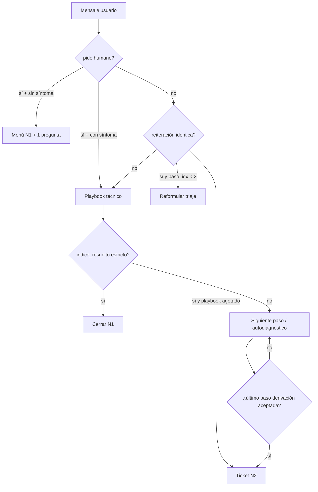

# Reporte QA — Bot N1 Portal Ecolan / Cooperativa Batán

**Fecha:** 2026-08-03 15:15 UTC  
**Portal:** https://ibot.ecolan.com/portal  
**Modo de ingreso:** Invitado / Guest  
**Método de ejecución:** Matriz completa vía Portal API (`/api/v1/portal/*`, org `coop-batan`) + smoke Playwright UI (login Invitado + chat) en E01, E08, E13  
**Escenarios ejecutados:** 15  
**Harness:** `qa_bot/` (Playwright + httpx) · Artefactos: `qa_bot/artifacts/`

---

## 1. Resumen ejecutivo

El bot **contiene bien el diagnóstico técnico N1** (fibra, radio, móvil) en la mayoría de los casos, pero **crea tickets humanos de forma innecesaria** ante dos patrones muy frecuentes en atención al cliente: pedido explícito de operador y reiteración de la misma queja.

| Métrica | Valor |
|---------|-------|
| Resolutividad autónoma N1 (heurística harness) | **60.0%** (9/15) |
| Resolutividad **ajustada** (revisión senior QA) | **~53%** (8/15) — E03 se degrada por falso cierre |
| Escenarios con ticket ofrecido/creado | 33.3% (5/15) |
| Tickets/derivaciones **prematuras** | **26.7%** (4/15) — impacto alto |
| Tickets creados en esta corrida (IDs observados) | `JSC-1006`, `JSC-1007`, `JSC-1008` |
| Latencia promedio por turno (API) | ~935 ms (máx ~1704 ms) |
| Score N1 promedio (harness) | 0.842 |

### Veredicto

**NO-GO suave para el objetivo “reducir tickets N1 innecesarios”.**

- **Fortaleza:** playbooks técnicos (FTTH / radio / móvil) guían autodiagnóstico (luces PON/LOS, reinicio ONT, PoE, APN) **sin ticket** en el happy path.
- **Riesgo crítico:** `pide_humano()` tiene prioridad absoluta y abre ticket en el **primer turno** (`JSC-1006`). La reiteración de “no tengo internet” abre ticket en el **segundo turno** (`JSC-1008`).
- **Bug de comprensión:** frases con “anda bien” parcial disparan cierre feliz (`indica_resuelto`) aunque el problema persista lejos del router.

---

## 2. Matriz de resultados

| ID | Escenario | Score | Resolutivo N1 | Ticket | Prematuro | Hallazgo senior |
|----|-----------|-------|---------------|--------|-----------|-----------------|
| E01 | Sin internet — fibra FTTH | 1.0 | ✅ | no | no | Triaje + reinicio ONT + luces: **excelente N1** |
| E02 | Internet lento horario pico | 0.63 | ❌ | sí | ⚠️ | Ofrece derivar sin recibir resultado del speedtest |
| E03 | WiFi no llega al fondo | 0.83* | ❌* | no | no | **Falso cierre** (“¡Genial! quedó resuelto”) ante “anda bien… lejos no” |
| E04 | Corte deuda / pago QR | 0.88 | ❌ | no | no | Detecta deuda pero **no entrega guía QR**; loop de “¿querés que te explique?” |
| E05 | Factura / saldo | 1.0* | ⚠️ | no | no | No ticket, pero **no resuelve** pedido de QR; conversación desalineada |
| E06 | Móvil IMOVI sin datos | 0.92 | ✅ | no | no | Datos → APN → roaming: buen N1 |
| E07 | Sin señal móvil | 1.0 | ✅ | no | no | Autodiagnóstico OK (puede reforzar orden de pasos) |
| E08 | Pedido prematuro de humano | 0.28 | ❌ | sí | ⚠️ | **Crítico:** ticket inmediato `JSC-1006` sin síntoma ni N1 |
| E09 | Alta / cambio de plan | 1.0 | ✅ | sí† | no | Handoff comercial correcto tras aclarar alta/zona |
| E10 | Internet radio/antena | 0.92 | ✅ | no | no | Reinicio CPE + LED + línea de vista: buen N1 |
| E11 | Persistencia post-N1 | 0.91 | ⚠️ | sí | ⚠️ leve | Ofrece visita un paso antes; luego crea `JSC-1007` (aceptable con ajuste) |
| E12 | Typos coloquiales | 0.88 | ✅ | no | no | 1er turno no clasifica “interntt”; 2º recupera con FTTH |
| E13 | Mensaje repetido idéntico | 0.52 | ❌ | sí | ⚠️ | **Crítico:** 2ª repetición → ticket `JSC-1008` |
| E14 | Ecolan B2B / DC | 1.0 | ✅ | no | no | Triaje B2B OK; podría acelerar handoff ante “caída productiva” |
| E15 | Teléfono fijo sin tono | 0.88 | ❌ | no | no | Re-pregunta tono/cable ya informados (poca memoria de hechos) |

\* Score harness sobreestima.  
† Ticket/handoff esperado (comercial).

---

## 3. Criterios aplicados por turno

Para cada respuesta se evaluó:

1. **¿Resolvió en el chat?** Instrucción accionable, menú de triaje o respuesta directa.
2. **¿Autodiagnóstico N1?** Reinicio ONT/router/CPE, luces, APN, QR Fiserv, etc.
3. **¿Ticket humano prematuro?** Derivación/creación sin agotar playbook (salvo comercial/B2B legítimo).
4. **¿Comprensión / bucles?** Cierres falsos, re-preguntas, o escalamiento por repetición.

Smoke Playwright (UI Invitado) **reprodujo** E01 (OK), E08 (ticket prematuro) y E13 (ticket por reiteración), alineado con API.

---

## 4. Fallas críticas (prioridad P0/P1)

### P0-1 — Pedido de operador → ticket inmediato (E08)

**Usuario:** *“Quiero hablar con una persona, pasame con un operador”*  
**Bot:** *“Te derivo con un agente. Ticket JSC-1006…”* (74 ms)  
**Segundo turno:** aunque aclara “no me anda internet”, responde *“Tu caso ya está derivado…”* y **bloquea N1**.

**Causa raíz (código):** en `app/services/canal_abonado.py`, `pide_humano(texto)` tiene **prioridad absoluta** y llama `_crear_ticket_n2` sin pedir síntoma ni ofrecer 1 paso N1.

```291:315:app/services/canal_abonado.py
    # Pedir agente tiene prioridad absoluta (también sin estar identificado)
    if pide_humano(texto):
        ...
        tid = _crear_ticket_n2(...)
        resp = (
            f"Te derivo con un agente. Ticket {tid}. "
            "Quedate en esta conversación, te van a responder acá."
        )
```

`pide_humano` matchea tokens amplios (`persona`, `operador`, `agente`, `humano`, …) en `app/domain/flujos_abonado.py`.

**Impacto:** cualquier abonado impaciente genera ticket N2 aunque el caso sea reinicio de router.

---

### P0-2 — Reiteración de la misma queja → ticket (E13)

**Usuario** repite 3× *“No tengo internet”*  
**Turno 2:** crea `JSC-1008` y aún pregunta tipo de conexión.  
**Turno 3:** *“Tu caso ya está derivado…”*

**Causa raíz:** bloque de frustración/reiteración en `canal_abonado.py` (`detecta_frustracion` / `registrar_queja`) escala a ticket **antes** de completar triaje de acceso. En producción se observó ticket en la 2ª repetición, sin haber avanzado el playbook.

**Impacto:** usuarios que reenvían el mismo mensaje (hábito típico de chat) generan tickets basura.

---

### P0-3 — Falso positivo de “resuelto” (E03)

**Usuario:** *“En el living anda bien, lejos no”*  
**Bot:** *“¡Genial! Qué bueno que quedó resuelto…”* y cierra.

**Causa raíz:** `indica_resuelto()` trata la substring **`anda bien`** como resolución global:

```480:489:app/domain/flujos_abonado.py
def indica_resuelto(texto: str) -> bool:
    ...
    claves = (
        "ya anda", "ya funciona", "ya volvio", "ya volvió",
        "mejoro", "mejoró", "anda bien", "quedó bien",
```

**Impacto:** abandono del diagnóstico WiFi de cobertura; mala UX y métricas N1 infladas.

---

### P1 — Facturación / QR en modo invitado (E04, E05)

- Detecta saldo pendiente pero responde con *“¿Querés que te explique cómo regularizarlo?”* **sin** pegar la guía QR Fiserv (Mercado Pago / MODO).
- Ante DNI en modo guest no identifica (anti-spoofing esperado) pero **tampoco** empuja CTA clara a login DNI+OTP ni instrucciones genéricas de pago.
- Pedido *“mandame el QR”* deriva a preguntas de medio/fecha de pago (desalineado).

**Impacto:** consultas de pago — muy frecuentes — no se autocontienen; empujan a humano o abandono.

---

### P1 — Internet lento escala temprano (E02)

Tras pedir speedtest, el usuario responde *“Es más a la noche”* (horario, no resultado) y el bot **ofrece derivación** (*“Te derivo con un agente…”*) sin insistir en el resultado del test ni en reinicio.

---

### P2 — Typos / hechos ya dichos (E12, E15)

- *“ola no anda el interntt…”* → saludo genérico (no clasifica internet al primer intento).
- Fijo sin tono: re-pregunta si hay tono / si el cable está bien **después** de que el usuario ya lo dijo.

---

## 5. Lo que funciona bien (baseline a preservar)

| Flujo | Comportamiento observado |
|-------|--------------------------|
| FTTH (E01) | Triaje fibra → reinicio ONT/router → PON/LOS → cable amarillo |
| Radio (E10) | Reinicio CPE → LED enlace → línea de vista / PoE |
| Móvil datos (E06) | Datos/modo avión → APN `internet.coopbatan.ar` → roaming |
| Comercial (E09) | Aclara alta vs cambio → ofrece derivación comercial (correcto) |
| B2B (E14) | Clasifica Ecolan / tipo de servicio sin ticket inmediato |
| Performance | Respuestas ~0.7–1.7 s vía API; UI guest estable |

---

## 6. % de resolutividad autónoma

```
Resolutividad harness (9/15) .............. 60%
Resolutividad ajustada senior (8/15) ...... ~53%
Meta típica N1 canal digital .............. ≥75–80% sin ticket prematuro
Tickets prematuros en matriz .............. 27%  (meta: <10%)
```

**Lectura:** el bot **sí puede** resolver N1 técnico; el gap vs objetivo no es falta de playbooks, sino **políticas de escalamiento demasiado agresivas** + **1 bug de cierre falso** + **debilidad en pagos/QR en invitado**.

---

## 7. Recomendaciones concretas (prompt + flujos + código)

### 7.1 Política anti-ticket prematuro (P0)

1. **Cambiar prioridad de `pide_humano`:**  
   - Si no hay `intencion` técnica aún → menú (internet / móvil / factura) + 1 pregunta.  
   - Solo crear ticket si: (a) el usuario insiste 2ª vez **después** del menú, o (b) dice `*agente*` explícito post-diagnóstico, o (c) playbook agotado.  
2. **Keyword `persona`/`operador`:** no escalar si el mensaje también contiene síntoma (`internet`, `wifi`, `factura`, `datos`). En ese caso ignorar handoff y entrar al playbook.
3. **Métrica de alerta:** `% tickets creados en turno ≤ 2` y `% tickets con motivo "Cliente solicitó agente humano"` sin pasos N1 en timeline.

### 7.2 Reiteración / frustración (P0)

1. En `detecta_frustracion`: exigir `paso_idx >= 2` **o** triaje de tipo de acceso completado antes de abrir ticket.  
2. Ante mensaje idéntico en paso 0: reformular (*“Para ayudarte necesito saber si es fibra, antena o ADSL”*) en lugar de `_crear_ticket_n2`.  
3. Contador `reiteracion_queja` no debe superar umbral de handoff hasta agotar al menos 3 pasos del playbook activo.

### 7.3 Fix `indica_resuelto` (P0)

1. Eliminar match suelto de `"anda bien"` / `"funciona"` sin anclas de resolución (*ya*, *volvió*, *quedó*, *ahora sí*).  
2. Si hay contraste (*pero*, *lejos*, *solo en*, *excepto*): **nunca** marcar resuelto.  
3. Test unitario: `"En el living anda bien, lejos no"` → `False`.

### 7.4 Pagos / QR en modo invitado (P1)

1. Plantilla fija al detectar `corte_deuda` / pago:  
   - Guía QR Fiserv (MP/MODO).  
   - “Al acreditarse se reactiva solo”.  
   - CTA: “Para ver tu saldo exacto, identificarte con DNI en el acceso seguro”.  
2. No abrir ticket de facturación en guest sin ofrecer antes login + guía QR.  
3. Prompt system: *“En modo invitado no inventes montos; sí podés explicar cómo pagar.”*

### 7.5 Prompt engineering del redactor LLM (P1)

Reforzar system prompt de `_redactar_con_llama` / motor canal:

- Nunca ofrecer ticket en turnos 1–2 de flujos `internet_*`, `wifi`, `movil_*`.  
- No reescribir un paso de diagnóstico como cierre feliz.  
- Si el usuario no contestó la pregunta anterior (ej. speedtest), **re-preguntar** esa misma pregunta una vez antes de derivar.  
- Conservar hechos ya dichos (tono=no, cable=ok) y no re-preguntarlos.

### 7.6 Robustez NLP (P2)

1. Ampliar `clasificar_intencion` con typos: `interntt`, `internt`, `wifii`, `no anda nada`, `sin senal`.  
2. En fijo: si el texto ya contiene “sin tono”, saltar `tono_fija` y pasar a cableado/derivación.

### 7.7 Cambios de flujo sugeridos (resumen)



---

## 8. Detalle de escenarios fallidos (transcripciones clave)

### E08 — Pedido de humano

| Rol | Texto |
|-----|-------|
| Usuario | Quiero hablar con una persona, pasame con un operador |
| Bot | Te derivo con un agente. Ticket **JSC-1006**. Quedate en esta conversación… |
| Usuario | Es que no me anda internet |
| Bot | Tu caso ya está derivado a un agente… |

**Criterios:** no resolvió · no autodiagnóstico · **ticket prematuro** · sin bucle.

### E13 — Reiteración

| Rol | Texto |
|-----|-------|
| Usuario | No tengo internet |
| Bot | ¿Qué tipo de servicio tenés: fibra óptica, radio o línea telefónica? |
| Usuario | No tengo internet |
| Bot | Ya generé el ticket **JSC-1008**… ¿Qué tipo de conexión tenés…? |
| Usuario | No tengo internet |
| Bot | Tu caso ya está derivado a un agente… |

### E03 — Falso cierre

| Rol | Texto |
|-----|-------|
| Usuario | El WiFi no llega a la habitación del fondo |
| Bot | ¿Falla en toda la casa o solo en la habitación del fondo? |
| Usuario | En el living anda bien, lejos no |
| Bot | **¡Genial! Qué bueno que quedó resuelto…** |

### E04 — Deuda sin QR

| Rol | Texto |
|-----|-------|
| Usuario | Me cortaron el servicio por falta de pago, ¿cómo pago? |
| Bot | Tu cuenta tiene un saldo pendiente… ¿Querés que te explique cómo podés regularizarlo? |
| Usuario | Mi DNI es 30111222 |
| Bot | Gracias… ¿Querés que te explique cómo regularizarlo? |

*(Esperado N1: instrucciones QR Fiserv + CTA identificación.)*

Transcripciones completas de los 15 escenarios: `qa_bot/artifacts/resultados_qa.json`.

---

## 9. Cómo reproducir

```bash
# Desde la raíz del repo
.venv/bin/pip install playwright httpx
.venv/bin/playwright install chromium

# Matriz completa API + smoke UI Invitado
.venv/bin/python -m qa_bot.run_qa --mode both

# Solo Playwright (portal real)
.venv/bin/python -m qa_bot.run_qa --mode playwright --scenarios E01,E08,E13

# Solo API
.venv/bin/python -m qa_bot.run_qa --mode api
```

Salida: `reporte_qa_bot.md` · `qa_bot/artifacts/resultados_*.json` · screenshots en `qa_bot/artifacts/screenshots/`.

---

## 10. Checklist de aceptación post-fix

- [ ] Pedir “operador/persona” **sin** síntoma → menú N1, **sin** ticket en T1  
- [ ] Pedir operador **con** “no anda internet” → entra playbook internet, **sin** ticket en T1  
- [ ] Repetir 3× “no tengo internet” → insiste en fibra/radio/ADSL, **sin** ticket antes de paso ≥2  
- [ ] “En el living anda bien, lejos no” → **no** cierra como resuelto; sigue cobertura WiFi  
- [ ] “Me cortaron por falta de pago” → guía QR Fiserv en el mismo turno  
- [ ] Happy path FTTH (E01) sigue verde  
- [ ] `% tickets turno≤2` en analytics baja respecto a baseline de esta corrida  

---

*Generado por harness QA N1 (`qa_bot/`) con revisión senior sobre transcripts de producción `ibot.ecolan.com`.*
